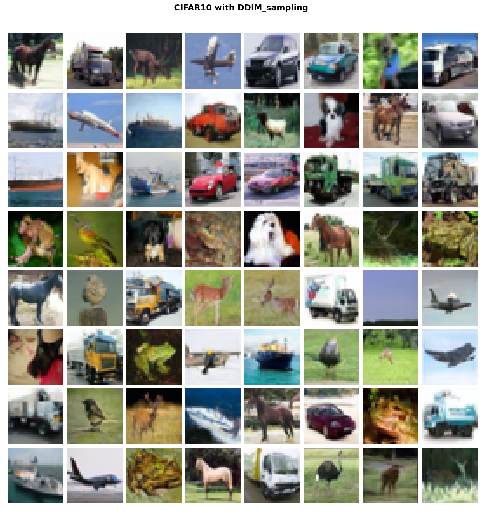
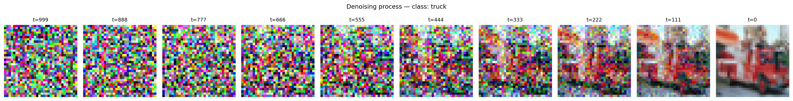

# DDPM — Denoising Diffusion Probabilistic Models

PyTorch implementation of [Ho et al. 2020](https://arxiv.org/abs/2006.11239) trained on CIFAR-10, with class-conditional generation via [Classifier-Free Guidance](https://arxiv.org/abs/2207.12598) and fast sampling via [DDIM](https://arxiv.org/abs/2010.02502).

---

<!-- Mets ta plus belle grille de samples ici — c'est la première chose qu'on regarde -->


*Samples générés après 500 epochs d'entraînement, guidance scale w=3*

---

## Résultats

### Processus de débruitage



*De gauche à droite : x_T ~ N(0,I) → x_0 (image finale)*

---

## Implémentation

### Ce qui est implémenté

- **DDPM** — forward process, reverse process, MSE loss sur le bruit prédit
- **U-Net** — architecture encoder/bottleneck/decoder avec ResBlocks, self-attention aux résolutions 8×8 et 16×16, embeddings sinusoïdaux pour le timestep
- **EMA** — Exponential Moving Average des poids avec warmup, utilisé exclusivement pour le sampling
- **Classifier-Free Guidance** — conditioning sur la classe CIFAR-10 avec dropout du label à 20%, guidance scale configurable
- **DDIM sampling** — sampling déterministe en N steps (N << 1000), avec paramètre eta

### Architecture U-Net

```
x_t (B, 3, 32, 32)
    │
    ▼ Conv 3×3
(B, 64, 32, 32) ──────────────────────────────────────── skip ──────┐
    │ ResBlock × 2                                                    │
    ▼ Downsample ↓2                                                   │
(B, 128, 16, 16) + Attention ──────────────────── skip ────────┐    │
    │ ResBlock × 2                                               │    │
    ▼ Downsample ↓2                                              │    │
(B, 256, 8, 8)  + Attention ──────── skip ────────────────┐    │    │
    │ ResBlock × 2                                          │    │    │
    ▼                                                       │    │    │
[ Bottleneck : ResBlock → Self-Attn → ResBlock ]           │    │    │
    │                                                       │    │    │
    ▼ cat(skip) ←──────────────────────────────────────────┘    │    │
    │ ResBlock × 2 + Attention                                   │    │
    ▼ Upsample ↑2                                                │    │
    cat(skip) ←─────────────────────────────────────────────────┘    │
    │ ResBlock × 2 + Attention                                        │
    ▼ Upsample ↑2                                                     │
    cat(skip) ←──────────────────────────────────────────────────────┘
    │ ResBlock × 2
    ▼ GroupNorm + SiLU + Conv 1×1
ε_θ(x_t, t, class) (B, 3, 32, 32)
```

---

## Entraînement

```bash
python main.py \
    --num_epochs 500 \
    --batch_size 128 \
    --lr 2e-4 \
    --base_channels 64 \
    --num_timesteps 1000 \
    --schedule cosine \
    --guidance_scale 3.0 \
    --label_dropout 0.2 \
    --output_dir outputs/ \
    --checkpoint_dir checkpoints/
```

Pour reprendre depuis un checkpoint :
```bash
python main.py --checkpoint_path checkpoints/ddpm_epoch_0250.pt
```

---

## Sampling

```bash
# Générer 16 images 
python generate.py \
    --checkpoint checkpoints/ddpm_epoch_0500.pt \
    --num_samples 16 \
    --guidance_scale 3.0 \
    --ddim_steps 50          # DDIM en 50 steps au lieu de 1000
```

Classes CIFAR-10 :
```
0: airplane   1: automobile   2: bird    3: cat    4: deer
5: dog        6: frog         7: horse   8: ship   9: truck
```

---

## Références

- [**DDPM** — Ho et al. 2020](https://arxiv.org/abs/2006.11239) — Denoising Diffusion Probabilistic Models
- [**Improved DDPM** — Nichol & Dhariwal 2021](https://arxiv.org/abs/2102.09672) — cosine schedule, architecture details
- [**DDIM** — Song et al. 2020](https://arxiv.org/abs/2010.02502) — Denoising Diffusion Implicit Models
- [**CFG** — Ho & Salimans 2022](https://arxiv.org/abs/2207.12598) — Classifier-Free Diffusion Guidance
